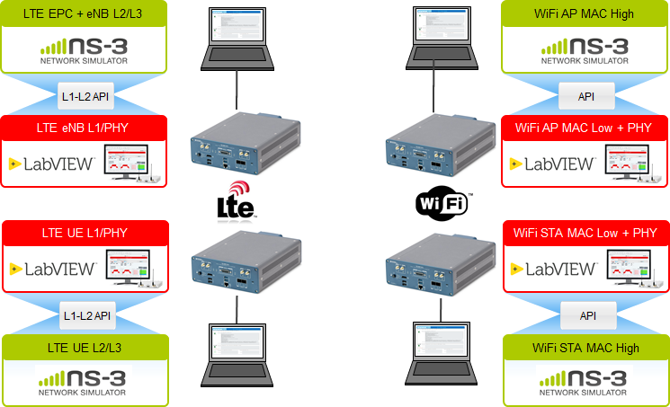
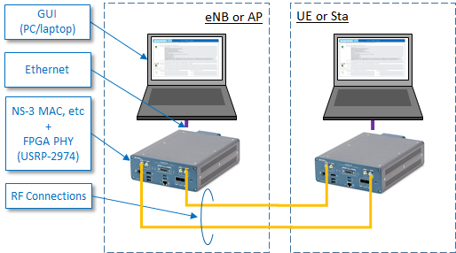

# National Instruments  ns-3 Application Example

This is an implementation of an API to interface ns-3 network simulator to NI software defined radios for 802.11 and LTE.

## Overview
The following figure shows an overview of the setup that can be used for 802.11 and LTE.



## Supported Hardware and Software
- Support for USRP-2974 ([Link](http://www.ni.com/en-us/support/model.usrp-2974.html))
- Support for LabVIEW Communications System Design Suite 2.0  ([LINK](http://www.ni.com/download/labview-communications-and-system-design-suite-2.0/6175/en/))
- Support for LabVIEW Communications LTE Application Framework 2.2 ([LINK](http://www.ni.com/download/lte-application-framework-2.2/7740/en/))
- Support for LabVIEW Communications 802.11 Application Framework 2.2 ([LINK](http://www.ni.com/download/802.11-application-framework-2.2/7739/en/) )
- Support for NI-USRP 17.2 Driver ([LINK](http://www.ni.com/download/ni-usrp-17.2/7584/en/) )
- Support for NI Linux RT LabVIEW Communications 2.0.1 Real-Time Target Image ([LINK](http://www.ni.com/download/labview-communications-and-system-design-suite-2.0/7754/en/) )
- Support for Single LTE eNB or 802.11 AccessPoint (AP) and single LTE UE or 802.11 Station (Sta)

 

## Installation Guide
The setup of the system can be accomplished in four steps

1. Prepare the Hardware
2. Install Linux RT
3. Install NS-3
4. Install LabVIEW Communications and Application Frameworks and run NI ns3 Application Example for 802.11 or LTE

These steps will be described in the next sections.
### Prepare the Hardware
The following hardware setup is supported and shall be cabled as shown.



### Install Linux RT

This section describes the installation of Linux RT on a USRP 2974.

**The following steps need to be executed on both eNB/AP and UE/Sta  USRP-2974.**

To use the ns-3 simulator with the L1/L2 API and integration towards the PHY layer implementations of the LTE and 802.11 Application Framework, the proper Linux RT image for the USRP-2974 as well as for LabVIEW Communications System Design Suite 2.0 has to be used. 

Download the image from [LabVIEW Communications 2.0.1 Real-Time Target Image](http://www.ni.com/download/labview-communications-and-system-design-suite-2.0/7754/en/)

Install the image as described under [Provisioning a Real-Time Controller or USRP Stand-Alone Device for LabVIEW Communications](http://www.ni.com/tutorial/54622/en/)  for every USRP-2974 in the setup.

### Install NS-3

This section describes the installation of the ns-3 stack with the L1/L2 API on a USRP-2974. 

**The following steps need to be executed on both eNB/AP and UE/Sta  USRP-2974.**

Connect remotely via ssh (use *ssh* under Linux or [putty](https://www.putty.org) under Windows). To find the correct IP address of the device, connect a monitor and keyboard to the USRP-2974 and run *ifconfig* to yield the IP address for *eth0* or check under the Hardware Tab in LabVIEW Communications System Design Suite (if already available) for the registered devices. Use username *root* with empty password.

For an automated installation process 

- Download the script from [src/ni/scripts/prepare_usrp_2974.sh](src/ni/scripts/prepare_usrp_2974.sh), 

- Copy the script to the USRP-2974 

- Execute the script on the USRP-2974

or proceed with the manual setup described below.

Install required packages from dependencies with the following commands:

```
opkg update
opkg install --force-downgrade packagegroup-core-buildessential git
```

Clone the repository and copy it to /home/root/ns-3.26

```
git clone https://github.com/ni/NI-ns3-ApplicationExample.git /home/root/ns-3.26 
```

Go into ns-3 folder

```
cd ns-3.26
```

Build/compile ns-3 code:

```
make
```

The compilation should run without an error.

Install binaries related to NI examples:

```
make install_ni
```

To check whether the NI ns3 Application Example has been compiled and installed correctly, just run

For LTE:  

```
ns3.26-ni-lte-simple-optimized
```

For 802.11

```
ns3.26-ni-wifi-simple-optimized
```

These calls of the compiled NI ns3 Application Examples for LTE and 802.11 are running the example in simulation mode where transmitter and receiver are both simulated in one ns3 instance without any connection to the NI Application Frameworks.

### Install LabVIEW Communications System Design Suite 2.0 and Application Frameworks 2.2 and run Application Examples

To connect with ns-3 properly over the L1/L2 API, the Application Frameworks need to be configured correctly.
The instructions to setup the 802.11 Application Framework and run the NI ns3 Application Example for 802.11 can be found here: [Setup 802.11 Application Framework](src/ni/doc/Setup_Wifi_AFW_ns3.pdf) 
The instructions to setup the LTE  Application Framework and run the NI ns3 Application Example for LTE can be found here:  [Setup LTE Application Framework](src/ni/doc/Setup_Lte_AFW_ns3.pdf) 

### LWA/LWIP Extension

In conjunction with the EU funded research project [ORCA](https://www.orca-project.eu) and the Open Call 1 for Extensions, an extension for the Wifi/LTE interworking technologies LWA and LWIP has been implemented. See a detailed description of the functionality from the authors [HERE](https://arxiv.org/abs/1901.03683). 

The extension can be used in simulation mode by running the following executable in the terminal:

```
ns3.26-ni-lte-wifi-extended-optimized
```

LWA/LWIP functionality can be configured in the corresponding main file: `ni-lte-wifi-extended.cc`.

### Dual Connectivity (DC) Extension
As an outcome of Open Call 2 for Extensions within the EU-funded research project ORCA, an extension of ns-3 for Dual Connectivity in LTE was developed.

The extension can be used in simulation mode as described in the following.

First, it is needed to setup the ethernet interface of your machine, e.g,, "eth0" into promiscous mode. 

This is achieved by running the following command. Please adapt the interface name to your machine settings.

```
sudo ip link set eth0 promisc on
```
Then the extension can be started by calling the appropriate binary and passing the name of the ethernet interface name:

```
ns3.26-dali-lte-dc-experimentation-optimized --fdDeviceName="eth0"
```
Further information about the usage can be found [HERE](src/dali/doc/DALI_ns3_User_Guide.pdf) .

A video tutorial, showcasing the functionality can be found [HERE](https://youtu.be/Ggr2q6KyQRI).

## Known Issues / Limitations
- NI examples are currently running only if binaries are build in optimized mode
- Transmission of packets with MTU size >=1500 bytes is not recommended because of packet fragmentation
- Tap bridge mode works only if logging is disabled (--niApiEnableLogging="false")
- On high CPU consumption (e.g. running experiments with high data rates) the eNB stack will drop packets (CNF_TIMEOUT) to ensure further real time processing
- LWA/LWIP
  - Only downlink is supported
  - Data aggregation on UE is not implemented (because NS-3 PDCP reordering is not available)
  - WIFI measurement reporting over LWA/LWIP is not implemented
- DC
  - RLC AM is not supported
  - Uplink and TCP functionalities are experimental
  - system instabilities on scenarios with high throughput (>30MBits) due to emu-fd-net-device limitations and MAC PDU assembly processing

## Additional Links
- [NI LTE Application Framework](http://www.ni.com/de-de/shop/select/labview-communications-lte-application-framework) 
- [NI 802.11 Application Framework](http://www.ni.com/de-de/shop/select/labview-communications-802-11-application-framework)
- [USRP-2974](http://www.ni.com/de-de/support/model.usrp-2974.html)
- [ORCA Project](https://www.orca-project.eu) 